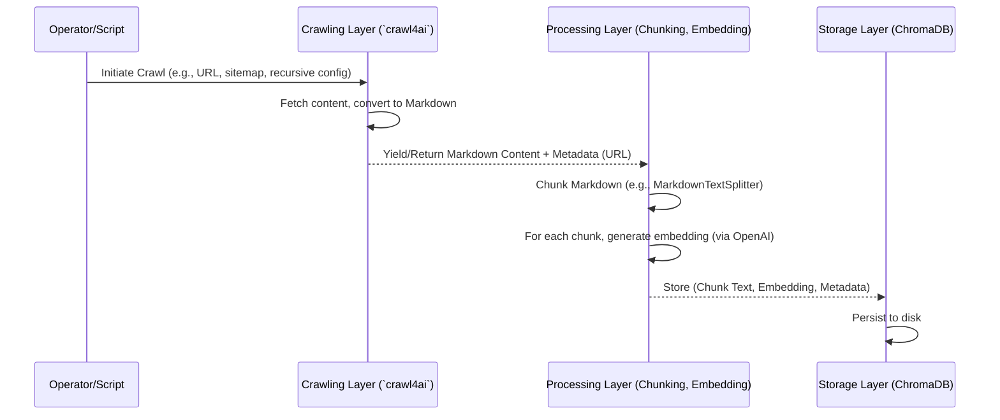
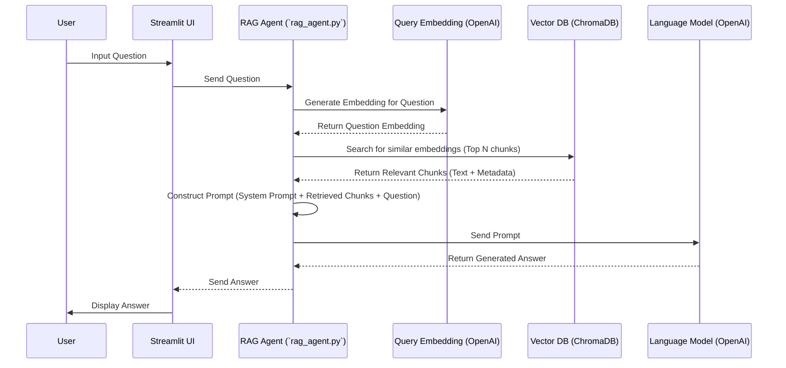

Copy Code
# Technical Architecture: Pydantic AI Documentation Crawler & RAG Agent

**Version:** 2.0
**Date:** 2025-05-19
**Project:** HANA-X Planning

## 1. Introduction

### 1.1. Purpose
This document outlines the technical architecture of the Pydantic AI Documentation Crawler and Retrieval Augmented Generation (RAG) Agent prototype. It serves as a foundational blueprint for understanding the system's components, their interactions, data flows, and operational considerations.

### 1.2. Project Goals
This prototype is a stepping stone within the larger Windsurf IDE AI initiative. The overarching goals influencing this architecture are:
*   **Foundational Blueprint:** To establish a robust, scalable, and repeatable technical and operational foundation, aiming to support a $100M company.
*   **Precision and Clarity:** To ensure that every layer of the system is designed with precision and clarity.
*   **Intern Onboarding & Scalable Teams:** To create a system and documentation that facilitate the onboarding of sharp but inexperienced interns, enabling them to learn and operate within a well-structured architecture.
*   **Leadership-Level Thinking:** To produce documentation and designs that reflect thorough, leadership-level thinking, capable of scaling across teams and surviving personnel turnover.

### 1.3. Scope
The scope of this document covers the open-source prototype designed to:
*   Crawl the Pydantic AI public documentation website.
*   Process the crawled content (specifically Markdown).
*   Store the processed content and its embeddings in a vector database (ChromaDB).
*   Provide a RAG-based question-answering interface via a Streamlit application, leveraging OpenAI models for embeddings and language generation.

This document details the current state based on the provided codebase and outlines considerations for future development and scaling.

## 2. High-Level Architecture

### 2.1. System Overview
The system is designed as a modular pipeline that ingests documentation from the web, processes it for efficient retrieval, and allows users to query the knowledge base using natural language questions.

### 2.2. Architectural Diagram (Conceptual)

```mermaid
graph TD
    A[User/Operator] --> F[Streamlit UI];
    F -- Query --> E[Retrieval & Interaction Layer];
    C[Crawling Layer] -- Fetched Content --> D[Processing Layer];
    D -- Processed Chunks & Embeddings --> G[Storage Layer (ChromaDB)];
    E -- Semantic Search Query --> G;
    G -- Relevant Chunks --> E;
    E -- Context + Query --> H[LLM (OpenAI)];
    H -- Generated Answer --> E;
    E -- Answer --> F;
    I[Input Sources (Pydantic Docs Website)] --> C;

    subgraph "RAG System"
    C
    D
    E
    F
    G
    H
    end

    style A fill:#c9daf8,stroke:#333,stroke-width:2px
    style I fill:#c9daf8,stroke:#333,stroke-width:2px
    style F fill:#fce5cd,stroke:#333,stroke-width:2px
    style C fill:#d9ead3,stroke:#333,stroke-width:2px
    style D fill:#d9ead3,stroke:#333,stroke-width:2px
    style G fill:#b4a7d6,stroke:#333,stroke-width:2px
    style E fill:#d9ead3,stroke:#333,stroke-width:2px
    style H fill:#ead1dc,stroke:#333,stroke-width:2px
```
### 2.3. Key Layers and Components
*   **Input Sources:**
    *   **Pydantic AI Documentation Website:** The primary source of information (e.g., `https://ai.pydantic.dev/`). Includes HTML pages, sitemaps, and potentially raw text/Markdown files like `llms-full.txt`.
*   **User/Operator:**
    *   Interacts with the system to initiate crawling/ingestion (Operator) or to ask questions (User via Streamlit UI).
*   **Crawling Layer:**
    *   **Responsibility:** Discovering and fetching content from the Pydantic AI documentation website.
    *   **Key Technologies/Scripts:** `crawl4ai` library, `requests`, `xml.etree.ElementTree`. Example scripts: `1-crawl_single_page.py`, `2-crawl_docs_sequential.py`, `3-crawl_sitemap_in_parallel.py`, `4-crawl_llms_txt.py`, `5-crawl_site_recursively.py`.
*   **Processing Layer:**
    *   **Responsibility:** Cleaning fetched content, converting it to Markdown (if not already), chunking the Markdown into manageable pieces, and generating embeddings for these chunks.
    *   **Key Technologies/Scripts:** Langchain `MarkdownTextSplitter`, custom regex-based chunking (from `4-crawl_llms_txt.py`), OpenAI embedding models (via `instructor` or directly). Core script: `insert_docs.py`.
*   **Storage Layer:**
    *   **Responsibility:** Storing the processed text chunks and their corresponding vector embeddings, along with relevant metadata (e.g., source URL).
    *   **Key Technologies/Scripts:** ChromaDB. Core scripts: `insert_docs.py`, `utils.py`.
*   **Retrieval & Interaction Layer (RAG Agent):**
    *   **Responsibility:** Receiving a user query, converting it to an embedding, performing a similarity search in ChromaDB to find relevant text chunks, constructing a prompt with the query and retrieved context, interacting with an LLM to generate an answer, and returning the answer.
    *   **Key Technologies/Scripts:** `pydantic-ai` (`RetrievalChain`), `instructor`, OpenAI LLMs (e.g., GPT-3.5-turbo, GPT-4), ChromaDB. Core script: `rag_agent.py`.
*   **Presentation Layer (Streamlit UI):**
    *   **Responsibility:** Providing a web-based chat interface for users to ask questions and view answers generated by the RAG agent.
    *   **Key Technologies/Scripts:** Streamlit. Core script: `streamlit_app.py`.

### 3. Key Layers and Components (Detailed)
#### 3.1. Crawling Layer
*   **Responsibilities:**
    *   Fetching web content from specified URLs or discovered links.
    *   Handling different crawling strategies: single page, multiple URLs sequentially or in parallel, sitemap-based, and recursive site crawling.
    *   Extracting links for recursive crawling.
    *   Optionally converting fetched content to Markdown (a core feature of `crawl4ai`).
*   **Key Technologies:**
    *   `crawl4ai`: The primary library used for web crawling. It provides `AsyncWebCrawler` for asynchronous operations, `BrowserConfig` for headless browser settings, `CrawlerRunConfig` for per-run settings, `MemoryAdaptiveDispatcher` for resource-aware parallel crawling, and `CacheMode`.
    *   `requests`: Used by helper functions (e.g., `get_pydantic_ai_docs_urls`) to fetch sitemap files directly.
    *   `xml.etree.ElementTree`: Used to parse XML sitemaps.
*   **Core Scripts & Functionality Demonstrated:**
    *   **`1-crawl_single_page.py`:** Demonstrates basic fetching of a single URL and outputting its content as Markdown using `AsyncWebCrawler.arun()`. Minimal configuration.
    *   **`2-crawl_docs_sequential.py`:**
        *   Fetches URLs from a sitemap (`get_pydantic_ai_docs_urls`).
        *   Crawls these URLs sequentially using `AsyncWebCrawler.arun()` in a loop.
        *   Introduces explicit `BrowserConfig` (headless, extra args for stability) and `CrawlerRunConfig`.
        *   Demonstrates manual crawler lifecycle (`start()`/`close()`) and session reuse (`session_id`) for efficiency when crawling multiple pages from the same site.
        *   Checks `result.success` and `result.error_message` for basic error reporting per URL.
    *   **`3-crawl_sitemap_in_parallel.py`:**
        *   Also fetches URLs from a sitemap.
        *   Introduces `AsyncWebCrawler.arun_many()` for parallel crawling of multiple URLs.
        *   Utilizes `MemoryAdaptiveDispatcher` to manage concurrency based on system memory (`memory_threshold_percent`, `check_interval`) and a `max_session_permit`. This is crucial for scalable and stable crawling of many pages.
        *   Includes `psutil` for monitoring and logging peak memory usage.
        *   Uses `CacheMode.BYPASS` to ensure fresh content.
    *   **`4-crawl_llms_txt.py` (aka `4-crawl_and_chunk_markdown.py`):**
        *   Crawls a single URL expected to be a Markdown or text file (e.g., `llms-full.txt`).
        *   Primarily demonstrates a post-crawling processing step (chunking), but its crawling part is a simple `arun()` call.
    *   **`5-crawl_site_recursively.py` (aka `5-crawl_recursive_internal_links.py`):**
        *   Implements recursive, depth-limited crawling starting from a seed URL.
        *   Uses `arun_many()` with `MemoryAdaptiveDispatcher` for parallel crawling at each depth level.
        *   Relies on `result.links.get("internal", [])` from `crawl4ai` to discover new internal links.
        *   Employs a `visited` set and URL normalization (using `urllib.parse.urldefrag`) to prevent re-crawling and infinite loops.
        *   Provides a comprehensive strategy for site-wide content acquisition.
    *   **`insert_docs.py` (Crawling Part):**
        *   Acts as an orchestrator for crawling (using `AsyncWebCrawler.arun()`) and then processing.
        *   Configures `BrowserConfig` and `CrawlerRunConfig`.
        *   Includes basic `logging` for crawl errors.

#### 3.2. Processing Layer
*   **Responsibilities:**
    *   Transforming raw crawled content (primarily HTML or direct Markdown) into clean, structured Markdown suitable for chunking. `crawl4ai` handles much of the initial HTML-to-Markdown conversion.
    *   Dividing the Markdown content into smaller, semantically relevant chunks.
    *   Generating vector embeddings for each text chunk.
    *   Collecting metadata associated with each chunk (e.g., source URL).
*   **Key Technologies:**
    *   **Text Splitting/Chunking:**
        *   Langchain `MarkdownTextSplitter` (used in `insert_docs.py`): Splits text based on Markdown-specific separators (like headers, paragraphs, code blocks) while trying to adhere to `chunk_size` and `chunk_overlap` parameters.
        *   Custom Regex-based splitting (demonstrated in `4-crawl_llms_txt.py`): Splits Markdown based on H1 (`#`) and H2 (`##`) headers.
    *   **Embedding Generation:**
        *   OpenAI Embedding Models (e.g., `text-embedding-ada-002`): Accessed via the `instructor` library (as seen in `rag_agent.py` for queries, and implicitly by `insert_docs.py` which uses ChromaDB's default embedding function or a configured one).
*   **Core Scripts & Functionality Demonstrated:**
    *   **`insert_docs.py` (Processing Part):**
        *   Takes Markdown content (presumably from `crawl4ai`'s output).
        *   Uses `MarkdownTextSplitter` to break down the Markdown into chunks of a specified `chunk_size` (e.g., 500) and `chunk_overlap` (e.g., 100).
        *   Constructs `Document` objects (from Langchain or a similar structure) containing the chunk content and metadata (source URL).
        *   Handles the embedding generation implicitly via ChromaDB's `add_documents` if an embedding function is configured for the collection, or explicitly if embeddings were pre-generated.
    *   **`4-crawl_llms_txt.py` (Chunking Part):**
        *   Provides an alternative, custom chunking strategy.
        *   Uses `re.compile(r'^(# .+|## .+)$', re.MULTILINE)` to find H1 and H2 headers.
        *   Splits the content such that each chunk starts with an H1 or H2 header and extends to the next such header or the end of the document.
        *   This demonstrates a rule-based approach to logical segmentation.
*   **Detailed Chunking Logic and Customization (Enhanced Details):**
    *   **`MarkdownTextSplitter` (in `insert_docs.py`):**
        *   *Mechanism:* Attempts to split along Markdown-specific separators first (double newlines for paragraphs, then single newlines, then spaces), and also respects code blocks and list structures to some extent. It aims to keep these semantic units together before falling back to character-based splitting if a unit exceeds `chunk_size`.
        *   *Nested Headers/Complex Structures:* Its handling of deeply nested structures is heuristic. It will try to keep them within a chunk if they fit the size, but might split within them if necessary.
        *   *Customization:* Highly customizable via `chunk_size` and `chunk_overlap`. Different Langchain splitters (e.g., `RecursiveCharacterTextSplitter` for more general text, or future semantic splitters) can be easily swapped in.
    *   **Custom Header-Based Chunking (in `4-crawl_llms_txt.py`):**
        *   *Mechanism:* Purely structural, based on lines starting with `# ` or `## `.
        *   *Nested Headers:* Does not inherently handle H3, H4, etc., as sub-chunks unless the logic is explicitly extended. Content under an H3 would remain part of the parent H1/H2 chunk.
        *   *Customization:* Requires direct modification of the Python regex and slicing logic to change behavior (e.g., include H3, alter how headers are included/excluded).
    *   **Implications of Chunk Size/Overlap:**
        *   *Chunk Size:* Smaller chunks (e.g., 256-512 characters) can offer more precise retrieval targets but might fragment context, requiring the LLM to synthesize information from more, smaller pieces. Larger chunks (e.g., 1000-2000 characters) provide more local context per chunk but risk including irrelevant information (noise) and may exceed LLM context window limits if too many are retrieved. The optimal size often depends on the documentation's nature and the LLM's capabilities.
        *   *Chunk Overlap:* (e.g., 50-200 characters) is crucial for maintaining semantic continuity across chunk boundaries. It ensures that sentences or ideas aren't abruptly cut off, reducing the chance of losing context that spans two chunks.
    *   **Ease of Modification:**
        *   The Langchain-based approach in `insert_docs.py` is generally easier to modify for standard strategies by changing splitter types or parameters.
        *   The custom regex approach in `4-crawl_llms_txt.py` offers maximum control for unique rules but requires more coding effort to adapt.
    *   **Future Considerations:** Experimentation with different chunk sizes, overlaps, and even semantic chunking strategies (e.g., using embedding models to identify topical breaks) will be key to optimizing retrieval quality. Enriching chunks with detailed metadata (e.g., original header hierarchy, page title) is also beneficial.

#### 3.3. Storage Layer
*   **Responsibilities:**
    *   Persistently storing processed text chunks.
    *   Storing the corresponding vector embeddings for these chunks.
    *   Storing metadata associated with each chunk (e.g., source URL, potentially headers, titles).
    *   Providing an interface for adding, updating, and deleting documents/chunks.
    *   Enabling efficient similarity search on vector embeddings.
*   **Key Technologies:**
    *   **ChromaDB:** An open-source vector database used to store and search embeddings.
        *   The system uses `chromadb.PersistentClient` to ensure data is saved to disk (as configured in `utils.py` with a `CHROMA_DB_PATH`).
        *   Collections are created (e.g., `pydantic_ai_docs`) to hold related documents.
        *   An embedding function (e.g., `OpenAIEmbeddings` via `instructor` or ChromaDB's default integration with sentence-transformers) is associated with the collection to automatically generate embeddings if not provided.
*   **Core Scripts & Functionality Demonstrated:**
    *   **`insert_docs.py` (Storage Part):**
        *   Initializes a ChromaDB client using `get_chroma_client()` from `utils.py`.
        *   Retrieves or creates a collection using `get_or_create_collection(client, collection_name, embedding_function_name, distance_function)`.
        *   Adds processed documents (chunks with metadata and embeddings) to the collection using `collection.add(ids=[...], documents=[...], metadatas=[...])`. URLs are used as IDs, which can facilitate updates if the same URL is re-ingested.
    *   **`utils.py`:**
        *   `get_chroma_client()`: Returns a persistent ChromaDB client instance.
        *   `get_or_create_collection()`: Manages collection creation, allowing specification of the embedding function (e.g., "instructor_openai_ada") and distance metric (e.g., "cosine").
        *   `query_collection()`: Provides a utility to query a collection, returning a specified number of results (`n_results`).
        *   `delete_documents()`: Allows deletion of documents by ID.
        *   `get_collection_info()`: Retrieves information about a collection.
        *   `clear_collection()`: Deletes all documents from a collection.

#### 3.4. Retrieval & Interaction Layer (RAG Agent)
*   **Responsibilities:**
    *   Accepting a natural language query from the user (via the Presentation Layer).
    *   Generating an embedding for the user's query.
    *   Performing a similarity search against the vector embeddings in ChromaDB to retrieve the most relevant text chunks (context).
    *   Constructing a prompt that includes the original user query and the retrieved context.
    *   Sending the prompt to a large language model (LLM).
    *   Receiving the LLM's generated answer.
    *   Optionally, processing or formatting the answer before sending it back to the Presentation Layer.
*   **Key Technologies:**
    *   **`pydantic-ai` (`instructor`):** Used for interacting with OpenAI models in a structured way. `RetrievalChain` from `pydantic-ai` (or a similar custom chain built with `instructor`) orchestrates the RAG flow: retrieval -> context augmentation -> LLM call.
    *   **OpenAI LLMs:** Language models like GPT-3.5-turbo or GPT-4 are used for generating answers based on the provided context and query.
    *   **ChromaDB Client:** Used for performing the similarity search (retrieval step).
    *   **`instructor.patch()`:** Enables structured responses from OpenAI models if Pydantic models are used to define the desired output schema.
*   **Core Scripts & Functionality Demonstrated:**
    *   **`rag_agent.py`:**
        *   Defines `RAGAgent` class.
        *   Initializes with an OpenAI client (patched by `instructor`) and a ChromaDB collection.
        *   The core logic likely resides in a method like `answer_question` or similar, which would internally use a `RetrievalChain` or equivalent.
        *   The `RetrievalChain` is configured with:
            *   An LLM instance (e.g., `OpenAI(model="gpt-3.5-turbo")`).
            *   A retriever that queries the ChromaDB collection (e.g., `ChromaRetriever(collection=self.collection, embedding_function=OpenAIInstructorEmbeddingFunction("text-embedding-ada-002"), top_n=5)`).
        *   Defines a `SystemPrompt` to guide the LLM's behavior, instructing it to use the provided context and to avoid making up answers.
    *   **`utils.py` (Querying Part):**
        *   The `query_collection` function is used by the retriever component of the RAG agent to fetch relevant chunks from ChromaDB.
*   **LLM Interaction Details (Prompting/Context Management) (Enhanced Details):**
    *   **Context Formatting and Presentation:**
        *   The `RetrievalChain` (or equivalent logic in `rag_agent.py`) fetches the `top_n` most relevant document chunks from ChromaDB based on semantic similarity to the user's query embedding.
        *   The text content of these retrieved chunks is typically concatenated, often separated by newlines or other markers, to form a single block of context.
        *   This combined context string is then inserted into a predefined slot within the prompt template that is sent to the LLM, along with the user's original query.
    *   **Prompt Engineering Techniques:**
        *   The `rag_agent.py` explicitly uses a `SystemPrompt`: `"You are a world-class query understanding and information retrieval system designed to answer questions based on a given context from Pydantic's V2 documentation. Use the following pieces of context to answer the users question. Your answer should be concise and directly address the question. If you don't know the answer based on the context, just say that you don't know, don't try to make up an answer. Do not go outside of the provided context."`
        *   This prompt clearly defines:
            *   **Role:** "world-class query understanding and information retrieval system."
            *   **Task:** "answer questions based on a given context."
            *   **Constraint:** "Use the following pieces of context."
            *   **Conciseness:** "Your answer should be concise."
            *   **Honesty/No Hallucination:** "If you don't know the answer... say that you don't know, don't try to make up an answer."
            *   **Context Adherence:** "Do not go outside of the provided context."
    *   **Handling Large or Contradictory Context:**
        *   The current system primarily relies on the LLM's inherent ability to sift through the provided concatenated context (typically 3-5 chunks based on common `top_n` retriever settings) and synthesize an answer based on the prompt's instructions.
        *   There is no explicit mechanism shown in `rag_agent.py` for advanced handling like:
            *   Re-ranking chunks based on relevance *after* initial retrieval but *before* LLM submission.
            *   Summarizing or compressing context if it exceeds a certain token limit (though the number of chunks retrieved implicitly limits this).
            *   Specifically resolving contradictions beyond the general instruction to be factual and not make things up.
        *   The effectiveness depends on the LLM's capacity to handle the amount of context provided and its instruction-following capabilities.
    *   **Future Considerations:** For more complex scenarios, techniques like re-ranking retrieved documents, query expansion (e.g., HyDE), or more sophisticated context distillation methods (e.g., "Lost in the Middle" mitigation by reordering chunks) could be explored. Providing source attribution for answers would also enhance trustworthiness.

#### 3.5. Presentation Layer (UI)
*   **Responsibilities:**
    *   Providing a user-friendly interface for users to input their questions.
    *   Displaying the answers generated by the RAG agent.
    *   Managing conversation history within a session.
*   **Key Technologies:**
    *   **Streamlit:** A Python library for creating interactive web applications with minimal code.
*   **Core Scripts & Functionality Demonstrated:**
    *   **`streamlit_app.py`:**
        *   Sets up the page title and basic layout.
        *   Initializes the `RAGAgent` (from `rag_agent.py`).
        *   Manages session state (`st.session_state`) to store chat messages (user queries and assistant responses).
        *   Displays past messages in the chat interface.
        *   Accepts user input via `st.chat_input()`.
        *   When a user submits a query:
            *   Appends the user's message to the session state and re-renders the chat.
            *   Calls the `RAGAgent` to get an answer.
            *   Displays the assistant's response (potentially using `st.write_stream` if the agent supports streaming responses, which `pydantic-ai` can).
            *   Includes basic error handling to display a message if the RAG agent fails.

## 4. Capabilities

*   **Content Acquisition:**
    *   Crawl single web pages.
    *   Crawl multiple URLs listed in a sitemap (sequentially or in parallel).
    *   Crawl websites recursively by following internal links up to a specified depth.
    *   Fetch raw text/Markdown files from URLs.
*   **Content Processing:**
    *   Convert HTML content to Markdown (via `crawl4ai`).
    *   Chunk Markdown documents using character-based splitting with Markdown awareness (Langchain `MarkdownTextSplitter`).
    *   Chunk Markdown documents using custom header-based (H1/H2) rules.
    *   Generate vector embeddings for text chunks using OpenAI models.
*   **Knowledge Storage:**
    *   Store text chunks, their embeddings, and metadata (source URLs) in a persistent ChromaDB vector store.
    *   Manage ChromaDB collections (create, clear, get info, delete documents).
*   **Question Answering:**
    *   Accept natural language questions through a web interface.
    *   Retrieve relevant context from the knowledge base using semantic search.
    *   Generate answers using an LLM, grounded in the retrieved context.
    *   Display conversation history.
*   **Resource Management (Crawling):**
    *   Utilize memory-adaptive dispatching for parallel crawling to manage system resources.
    *   Monitor and log peak memory usage during parallel crawls.

## 5. Detailed Features

### 5.1. Crawling & Ingestion
*   **FC01: Single Page Crawl:** Fetch and convert a single URL to Markdown (`1-crawl_single_page.py`).
*   **FC02: Sitemap-Based Sequential Crawl:** Parse a sitemap.xml, fetch listed URLs sequentially, reusing browser session (`2-crawl_docs_sequential.py`).
*   **FC03: Sitemap-Based Parallel Crawl:** Parse a sitemap.xml, fetch listed URLs in parallel using memory-adaptive batching (`3-crawl_sitemap_in_parallel.py`). Includes memory monitoring.
*   **FC04: Recursive Site Crawl:** Start from a seed URL, discover internal links, and crawl recursively up to `max_depth`, using parallel, memory-adaptive batching per depth, with URL normalization and visited set for deduplication (`5-crawl_site_recursively.py`).
*   **FC05: Text/Markdown File Crawl:** Fetch content from a URL pointing to a raw text or Markdown file (`4-crawl_llms_txt.py`).
*   **FC06: Markdown Chunking (Langchain):** Split Markdown documents into specified `chunk_size` and `chunk_overlap` using `MarkdownTextSplitter` (`insert_docs.py`).
*   **FC07: Markdown Chunking (Custom Header):** Split Markdown documents based on H1/H2 headers (`4-crawl_llms_txt.py`).
*   **FC08: Embedding Generation:** Create vector embeddings for text chunks (implicitly via ChromaDB in `insert_docs.py` using OpenAI).
*   **FC09: ChromaDB Storage:** Store chunks, embeddings, and metadata (URL as ID) into a persistent ChromaDB collection (`insert_docs.py`, `utils.py`).
*   **FC10: Configurable Ingestion:** `insert_docs.py` allows specifying URL, collection name, and chunking parameters via command-line arguments.

### 5.2. RAG Agent & User Interface
*   **FR01: User Query Input:** Accept user questions via a Streamlit chat interface (`streamlit_app.py`).
*   **FR02: Semantic Context Retrieval:** Embed user query and retrieve relevant chunks from ChromaDB using semantic similarity (`rag_agent.py`, `utils.py`).
*   **FR03: LLM-Powered Answer Generation:** Use OpenAI LLM (via `pydantic-ai`/`instructor`) to generate answers based on query and retrieved context (`rag_agent.py`).
*   **FR04: System Prompt Guidance:** Employ a system prompt to guide LLM behavior, emphasizing context adherence and honesty (`rag_agent.py`).
*   **FR05: Conversation History:** Display chat history in the Streamlit UI (`streamlit_app.py`).
*   **FR06: Basic Error Display:** Show a generic error message in UI if RAG agent fails (`streamlit_app.py`).

## 6. Data Flow

### 6.1. Data Ingestion Flow

**Narrative:**
1.  The **Operator** (or an automated script like `insert_docs.py`) initiates the crawling process, providing target URLs, sitemap links, or recursive crawl parameters to the **Crawling Layer**.
2.  The **Crawling Layer** (using `crawl4ai`) fetches the content from the web. This may involve single pages, parallel fetching of multiple pages, or recursive discovery of links. `crawl4ai` converts HTML content to Markdown.
3.  The raw Markdown content, along with its source URL (as metadata), is passed to the **Processing Layer**.
4.  The **Processing Layer** takes the Markdown and splits it into smaller chunks using a defined strategy (e.g., `MarkdownTextSplitter` in `insert_docs.py`).
5.  For each text chunk, a vector embedding is generated (e.g., using OpenAI's embedding models).
6.  The text chunks, their corresponding embeddings, and metadata (including the source URL) are sent to the **Storage Layer**.
7.  **ChromaDB** stores this information persistently, indexing the embeddings for efficient similarity search.

### 6.2. Query & Answer Flow

**Narrative:**
1.  The **User** types a question into the **Streamlit UI**.
2.  The **UI** sends the question to the **RAG Agent**.
3.  The **RAG Agent** takes the user's question and sends it to an embedding model (e.g., OpenAI) to get a **Query Embedding**.
4.  The **RAG Agent** uses this query embedding to search the **Vector DB (ChromaDB)**. ChromaDB performs a similarity search and returns the `N` most relevant text chunks (and their metadata) from its store.
5.  The **RAG Agent** then constructs a detailed **Prompt**. This prompt typically includes:
    *   A system message defining the LLM's role and instructions (e.g., "answer based on context," "don't make things up").
    *   The relevant text chunks retrieved from ChromaDB (the "context").
    *   The original user question.
6.  This complete prompt is sent to the **Language Model (LLM)** (e.g., OpenAI GPT-3.5-turbo).
7.  The **LLM** processes the prompt and generates an answer based on the provided context and its general knowledge, guided by the system prompt.
8.  The generated answer is returned to the **RAG Agent**.
9.  The **RAG Agent** sends the answer back to the **Streamlit UI**.
10. The **UI** displays the answer to the **User**.

## 7. Key Technologies & Dependencies

*   **Crawling:**
    *   `crawl4ai`: Core asynchronous web crawling library.
    *   `requests`: For direct HTTP calls (e.g., fetching sitemaps).
    *   `psutil`: For system resource monitoring during crawls.
    *   `xml.etree.ElementTree`: For parsing XML sitemaps.
    *   `urllib.parse`: For URL manipulation (e.g., `urldefrag`).
*   **Processing & Embedding:**
    *   `langchain` (specifically `langchain.text_splitter.MarkdownTextSplitter`): For Markdown-aware text chunking.
    *   `re` (Python standard library): For custom regex-based chunking.
    *   OpenAI API: For generating text embeddings (e.g., `text-embedding-ada-002`).
*   **Storage:**
    *   `chromadb`: Vector database for storing and searching embeddings and text chunks.
*   **RAG Agent & LLM Interaction:**
    *   `pydantic-ai` (`instructor`): For structured interaction with OpenAI models, including LLMs and embedding functions. Facilitates `RetrievalChain` implementation.
    *   OpenAI API: For large language models (e.g., `gpt-3.5-turbo`, `gpt-4`).
*   **User Interface:**
    *   `streamlit`: For building the interactive web application.
*   **Core Python & Environment:**
    *   `asyncio`: For asynchronous programming throughout the system.
    *   `python-dotenv`: For managing environment variables (like API keys).
    *   `logging` (Python standard library): For application logging.

## 8. Configuration & Usage

### 8.1. Environment Variables
*   `OPENAI_API_KEY`: **Required.** Your OpenAI API key. This must be set in the environment for `insert_docs.py`, `rag_agent.py`, and `streamlit_app.py` to function.
*   `CHROMA_DB_PATH`: **Optional.** Path to the directory where ChromaDB should persist its data. Defaults to `./db/chroma.db` in `utils.py`.
*   `LOG_LEVEL`: **Optional.** Controls logging verbosity for scripts using the `logging` module (e.g., `insert_docs.py`). Defaults to `INFO`.

### 8.2. Running Ingestion Scripts
*   **`insert_docs.py`:**
    ```bash
    python insert_docs.py --url <target_url_or_sitemap> --collection <collection_name> [--chunk_size <int>] [--chunk_overlap <int>] [--embedding_function <embedding_function_name>] [--distance_function <distance_function_name>]
    ```
    *   Example: `python insert_docs.py --url https://ai.pydantic.dev/sitemap.xml --collection pydantic_ai_docs`
*   **Example Crawler Scripts (`1-*.py` to `5-*.py`):**
    *   These are generally run directly: `python <script_name>.py`
    *   Some may have hardcoded URLs or parameters that might need adjustment for different targets.

### 8.3. Running the Streamlit Application
```bash
streamlit run streamlit_app.py
```
This will start a local web server, and you can access the RAG chat interface in your browser (typically at `http://localhost:8501`).

## 9. Operational Considerations

This section details critical operational aspects, reflecting current capabilities and identifying areas for enhancement to ensure robustness, scalability, and maintainability.

### 9.1. Error Handling and Resilience Strategy

A robust error handling and resilience strategy is paramount for a system intended for continuous operation and scaling.

*   **Current Error Handling Mechanisms:**
    *   **Crawling Operations:**
        *   The `crawl4ai` library (used in `2-crawl_docs_sequential.py`, `3-crawl_sitemap_in_parallel.py`, `5-crawl_site_recursively.py`) returns a `result` object with a `success` flag and `error_message`. Scripts check this to log issues for individual URL crawls (e.g., HTTP 404s, 503s).
        *   `insert_docs.py` uses `try-except` blocks around `crawler.arun()` and ChromaDB interactions, logging exceptions via Python's `logging` module.
        *   Sitemap fetching (`get_pydantic_ai_docs_urls` in `2-crawl_docs_sequential.py`) is wrapped in `try-except` to handle retrieval/parsing errors.
    *   **Robots.txt:** Explicit `robots.txt` handling is not detailed in the scripts. `crawl4ai`'s default behavior should be verified for compliance.
    *   **Unparseable Documents/Embedding Failures:**
        *   If `crawl4ai` fails Markdown conversion, `result.success` would be false.
        *   Embedding/ChromaDB insertion failures in `insert_docs.py` are caught by general `try-except` blocks. Specific retry logic is not present.
    *   **Error Logging and Surfacing:**
        *   Example crawlers often use `print()`.
        *   `insert_docs.py` uses the `logging` module.
        *   `streamlit_app.py` displays a generic error message in the UI for RAG agent failures.

*   **Gaps and Future Enhancements for Resilience:**
    *   **Retry Mechanisms:** Implement configurable retry logic (e.g., exponential backoff) for transient errors in crawling, embedding generation, and LLM calls.
    *   **Dead Letter Queues:** For persistent ingestion failures, move problematic items to a separate queue for manual inspection and reprocessing.
    *   **Centralized & Structured Logging:** Adopt standardized, structured logging (e.g., JSON) across all components and integrate with a centralized logging platform (e.g., ELK, Grafana Loki, Datadog) for improved monitoring, alerting, and debugging.
    *   **Proactive Alerting:** Set up alerts for critical failures, such as high crawl error rates, embedding service downtime, or consistent RAG agent failures.
    *   **Graceful Degradation:** Design components to handle temporary unavailability of dependencies (e.g., RAG agent serving a maintenance message if ChromaDB or LLM is down).
    *   **Explicit `robots.txt` Compliance:** Ensure `crawl4ai` is configured to strictly adhere to `robots.txt` directives, including `Crawl-delay`.

### 9.2. Data Update and Maintenance Strategy

The utility of the RAG system hinges on the freshness and accuracy of its knowledge base.

*   **Current Data Update Mechanisms:**
    *   `insert_docs.py` uses URLs as document IDs in ChromaDB. Re-ingesting a document with the same URL (assuming ChromaDB's `add` with existing IDs updates) effectively refreshes its content.
    *   Crawlers using `CacheMode.BYPASS` (e.g., `3-crawl_sitemap_in_parallel.py`) fetch fresh content on each run.
    *   No explicit mechanism is shown for identifying *only changed* pages; a full re-crawl of the defined scope (sitemap, recursive depth) appears to be the current update method.

*   **Gaps and Future Enhancements for Data Maintenance:**
    *   **Incremental Updates:**
        *   Implement logic to detect content changes (e.g., HTTP `Last-Modified`/`ETag` headers, content hashing) to re-crawl and re-index only modified pages. This is crucial for efficiency with large documentation sites.
    *   **Stale/Deleted Content Removal:**
        *   Develop a process to identify and remove documents from ChromaDB if they are deleted from the source or are no longer in scope. This could involve comparing a list of successfully crawled URLs from the latest run against the URLs currently in ChromaDB and using `utils.py::delete_documents` for those not found.
    *   **Content Versioning:** For documentation where historical versions are important, explore strategies for versioning content within ChromaDB (though this adds complexity).
    *   **Scheduled & Automated Updates:** Integrate the ingestion pipeline with a scheduler (e.g., cron, Airflow, Celery Beat) for regular, automated updates.
    *   **Data Lineage and Auditing:** Track when content was ingested, from where, and by which version of the ingestion script.

### 9.3. Scalability Considerations and Potential Bottlenecks

Planning for scale is vital for a system intended as a foundational asset.

*   **Current Scalability Features:**
    *   **Crawling:** `arun_many` with `MemoryAdaptiveDispatcher` in `3-crawl_sitemap_in_parallel.py` and `5-crawl_site_recursively.py` provides good single-machine parallelism for crawling.
    *   **Ingestion:** `insert_docs.py` processes and inserts documents, with potential for batching.

*   **Anticipated Bottlenecks and Future Scaling Strategies:**
    *   **Crawling:**
        *   *Single-Machine Limit:* For very large sites, consider a distributed crawling architecture (e.g., using a task queue like Celery with multiple worker nodes).
        *   *Target Server Load:* Implement more sophisticated politeness mechanisms (adaptive rate limiting, configurable delays) to avoid overwhelming target servers.
        *   *Network I/O:* Distributed workers can also alleviate single-machine network bottlenecks.
    *   **ChromaDB:**
        *   *Single Instance:* For large datasets (millions of documents), a single ChromaDB instance can become slow.
        *   *Scaling ChromaDB:* Explore ChromaDB's client/server deployment, optimize indexing strategies, or evaluate managed/distributed vector database solutions if growth demands it.
    *   **Embedding Model APIs:**
        *   *Rate Limits & Cost:* API calls for embeddings (and LLMs) can be bottlenecks.
        *   *Mitigation:* Implement robust batching for embedding requests, investigate caching strategies for embeddings if source text is identical, and explore options like self-hosted embedding models for cost/control at very high volumes.
    *   **LLM Interaction (RAG Agent):**
        *   *Rate Limits, Cost, Latency:* Similar to embedding models.
        *   *Mitigation:* Cache LLM responses for identical, context-stable queries (if applicable), optimize context size passed to the LLM, explore fine-tuning smaller, specialized models, or use model quantization if self-hosting.
    *   **Streamlit Application:**
        *   *Concurrent Users:* Streamlit's default server may struggle with high concurrency.
        *   *Scaling UI:* Deploy Streamlit with a production-grade ASGI server (e.g., Uvicorn with multiple workers), implement load balancing across multiple instances, or consider rebuilding the UI with a more traditionally scalable web framework if user load becomes a primary concern.
    *   **Processing Power (Chunking/Preprocessing):** For extremely large documents or computationally intensive preprocessing, this step could become CPU-bound. Offloading to separate processing workers could be considered.

### 9.4. Security Considerations

Ensuring secure operation is fundamental.

*   **Current Security Measures:**
    *   **API Key Management:** `OPENAI_API_KEY` is loaded from environment variables (`os.getenv`) in `rag_agent.py` and `streamlit_app.py`, which is good practice to avoid hardcoding secrets. Security then depends on the environment's protection.
    *   **Authenticated Site Crawling:** Not currently demonstrated.
    *   **Input Sanitization:** No explicit input sanitization is shown for user queries in `streamlit_app.py` before passing to the RAG agent. While vector DB queries are not typically vulnerable to SQL injection, prompt injection against the LLM is a concern.

*   **Gaps and Future Enhancements for Security:**
    *   **Secrets Management:** For production, use dedicated secrets management tools (e.g., HashiCorp Vault, AWS Secrets Manager, Azure Key Vault) for API keys and other sensitive configurations.
    *   **Authenticated Crawling:** If required, securely manage credentials (e.g., tokens, session cookies) for crawling sites that need authentication. `crawl4ai` might need configuration for this.
    *   **Input Validation and Sanitization:**
        *   Implement strict input validation for all user-provided data, especially queries to the RAG agent.
        *   Explore techniques to mitigate prompt injection, such as instruction defense, input/output filtering, or using LLM-based moderation endpoints.
    *   **Output Encoding:** Ensure all data rendered in the UI (especially LLM outputs) is properly encoded to prevent XSS vulnerabilities.
    *   **Network Security:** Implement firewalls and restrict network access to components (e.g., ChromaDB, Streamlit app) as per the principle of least privilege.
    *   **Dependency Management:** Regularly scan Python dependencies for known vulnerabilities (e.g., using `pip-audit`, Snyk, or GitHub Dependabot) and update them.
    *   **Principle of Least Privilege:** Ensure all components run with the minimum necessary permissions.

### 9.5. Testing and Validation Approach

A systematic testing strategy is crucial for quality, reliability, and maintainability.

*   **Current Testing/Validation:**
    *   The codebase does not include automated tests (unit, integration, E2E).
    *   Validation appears to be manual, likely through interaction with `streamlit_app.py` and observing script outputs.

*   **Gaps and Future Enhancements for Testing:**
    *   **Unit Tests:** Implement unit tests for:
        *   Utility functions (`utils.py`).
        *   Core logic within crawler scripts (e.g., URL normalization, sitemap parsing).
        *   Chunking strategies (both Langchain-based and custom).
        *   Isolated components of the `RAGAgent` (e.g., prompt formatting).
    *   **Integration Tests:**
        *   Test the crawling pipeline with a local, controlled set of static HTML/Markdown files.
        *   Verify the full ingestion pipeline: crawl -> chunk -> embed -> store in ChromaDB.
        *   Test the RAG pipeline: query -> retrieve -> generate answer, potentially mocking LLM/embedding API calls for determinism and cost control during testing.
    *   **End-to-End (E2E) Tests:**
        *   Automate interactions with the Streamlit UI to simulate common user flows and validate outcomes.
    *   **RAG Evaluation Metrics & "Golden Dataset":**
        *   Develop a "golden dataset" of question-answer pairs and/or question-relevant_context pairs specific to the Pydantic documentation.
        *   Implement and track RAG evaluation metrics:
            *   *Retrieval Metrics:* Precision@k, Recall@k, Mean Reciprocal Rank (MRR), Hit Rate for the ChromaDB retriever.
            *   *Generation Metrics:* For answer quality, consider metrics like BLEU/ROUGE (if reference answers exist), and more qualitative LLM-based evaluations for faithfulness, relevance, and absence of hallucination (e.g., using a separate LLM as an evaluator).
    *   **CI/CD Pipeline:** Integrate automated tests into a Continuous Integration/Continuous Deployment (CI/CD) pipeline to ensure code quality and prevent regressions.
    *   **Crawler Performance Monitoring:** Track metrics like pages crawled per minute, error rates per domain, average processing time per page, etc.

## 10. Future Enhancements & Roadmap (Illustrative)

*   Advanced Chunking Strategies: Implement and evaluate semantic chunking, or allow for strategy selection based on content type.
*   Improved Context Management: Explore techniques like context re-ranking, summarization for very large contexts, and "Lost in the Middle" mitigation.
*   Query Transformation: Implement query expansion or HyDE for improved retrieval.
*   Source Attribution: Clearly link answers back to the specific source document(s)/section(s) in the UI.
*   User Feedback Mechanism: Allow users to rate answer quality in the UI to collect data for fine-tuning or improving the system.
*   Distributed Crawling & Processing: For significantly larger scale, evolve towards a distributed architecture using task queues.
*   Fine-tuning Embedding/LLM Models: Explore fine-tuning models on Pydantic-specific data for improved domain adaptation (requires significant data and effort).
*   Multi-Modal RAG: If documentation includes significant diagrams or images, explore multi-modal RAG approaches.
*   Enhanced Observability: Implement comprehensive dashboards for monitoring system health, performance, and usage patterns.

## 11. Glossary

*   RAG: Retrieval Augmented Generation.
*   LLM: Large Language Model.
*   Vector Embedding: A dense numerical representation of text in a high-dimensional space.
*   Vector Database: A database optimized for storing and searching vector embeddings (e.g., ChromaDB).
*   Chunking: The process of breaking down large documents into smaller, manageable pieces.
*   Idempotency: An operation that has the same effect whether applied once or multiple times. Relevant for data ingestion.
*   Headless Browser: A web browser without a graphical user interface, used for automated web interaction.